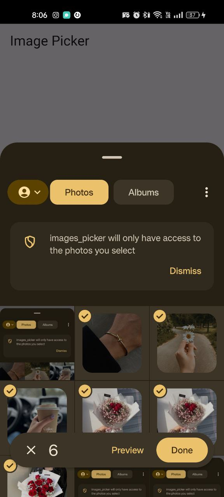
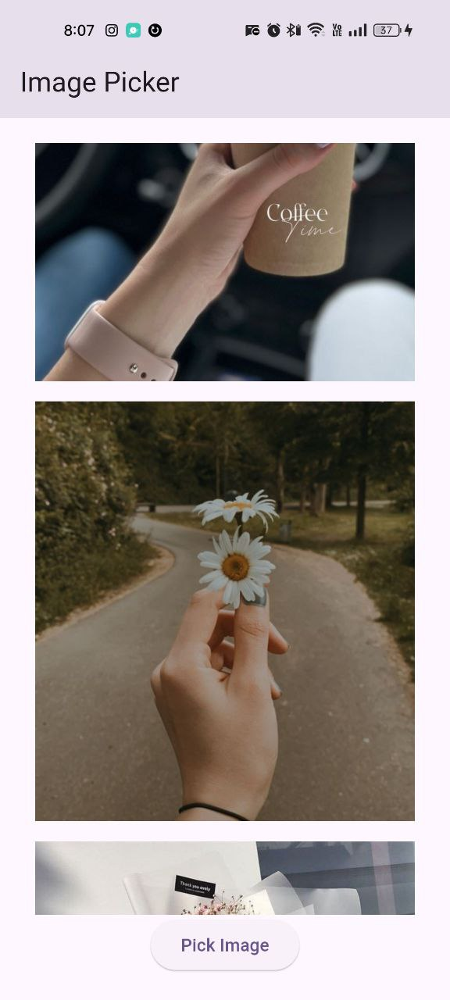
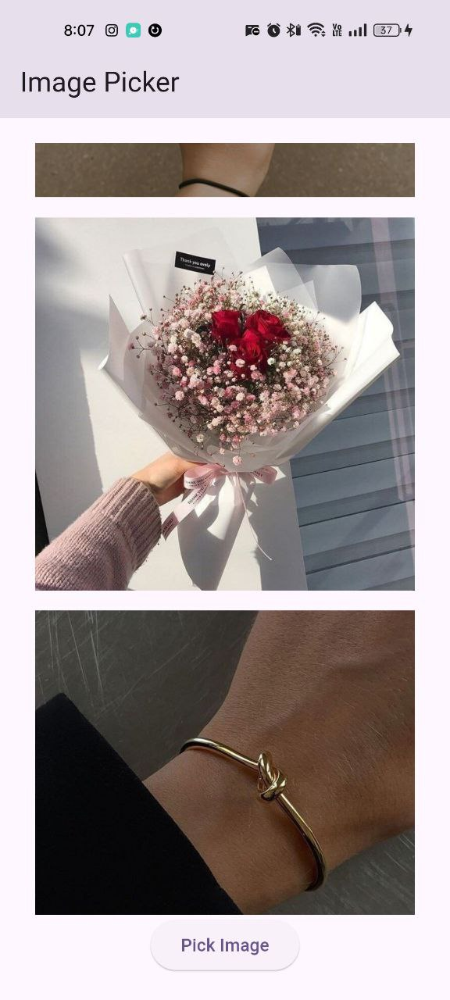

# images_picker

This Flutter app pickes image from phone storge and display them in listview.  

## Images

   
   
  

## Dependencies  
- `device_info_plus` for getting device information  

## Permissions  
- No special permissions required  

## How to Run  
1. Clone the repository  
2. Run `flutter pub get`  
3. Run the app on an emulator or physical device  

## Getting Started

This project is a starting point for a Flutter application.

A few resources to get you started if this is your first Flutter project:

- [Lab: Write your first Flutter app](https://docs.flutter.dev/get-started/codelab)
- [Cookbook: Useful Flutter samples](https://docs.flutter.dev/cookbook)

For help getting started with Flutter development, view the
[online documentation](https://docs.flutter.dev/), which offers tutorials,
samples, guidance on mobile development, and a full API reference.
