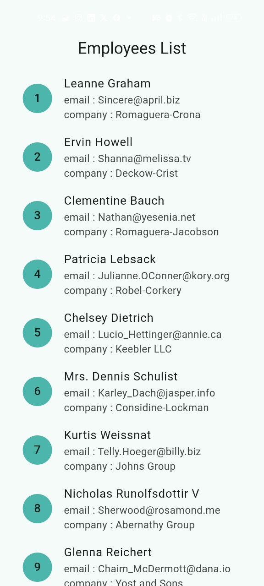
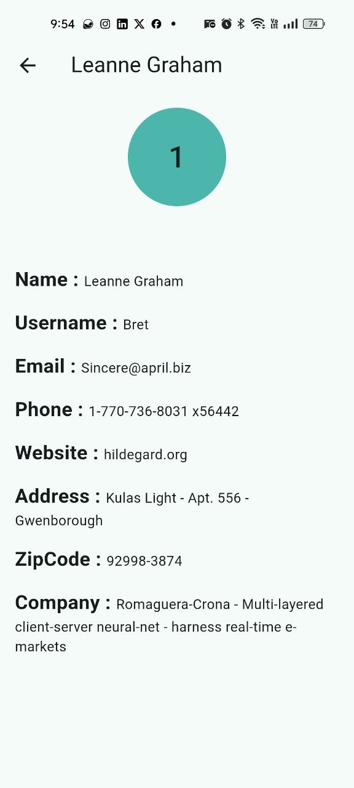

# employee_detailes

A new Flutter project fetches employees data from API and displays it in a listView , navigate between app screens , shows detailed information about selected employee in a second screen and cached data.

## Features 

 - Fetch employee data using dio.
 - Parse json responses into employee model.
 - Display Employees Data using ListView and ListTile.
 - Shows detailed information about selected employee in a second screen.
 - Navigate between app screens.
 - Caches app data using shared_preferences.
 - Display a loading indicator while fetching data.

## Images

  

## Installtion

 1. Clone the repository.
 2. Run 'flutter pub get' .
 3. Run the app using 'flutter run' .

## Contributing

Pull requests are welcome. For major changes, please open an issue first
to discuss what you would like to change.

Please make sure to update tests as appropriate.

## Getting Started

This project is a starting point for a Flutter application.

A few resources to get you started if this is your first Flutter project:

- [Lab: Write your first Flutter app](https://docs.flutter.dev/get-started/codelab)
- [Cookbook: Useful Flutter samples](https://docs.flutter.dev/cookbook)

For help getting started with Flutter development, view the
[online documentation](https://docs.flutter.dev/), which offers tutorials,
samples, guidance on mobile development, and a full API reference.

## Auther 
 Roaa Gawish 

## License