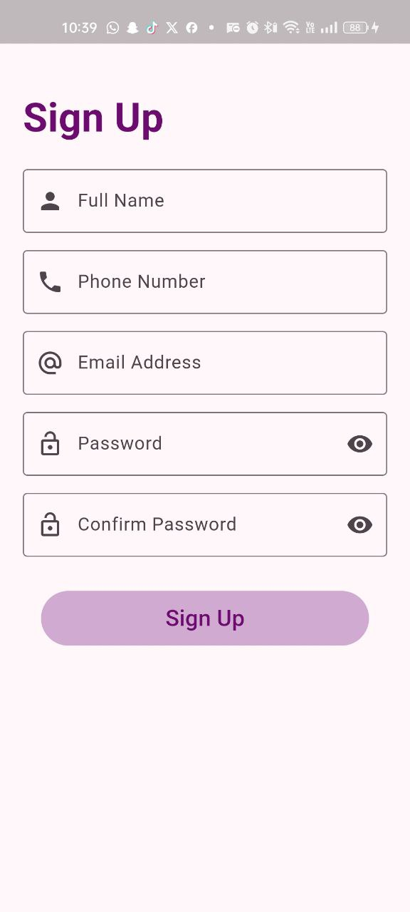
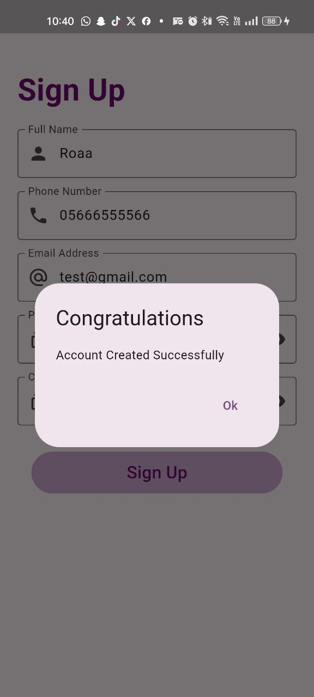

# sign_up_page

A new Flutter project for a shopping app with signup page contains two screen (signup and home ) contains some common flutter widgets : 
1- Form 
2- TextFormField
3- MatrialButton
4- Statefull widget
5- Column and Row
6- Gridview
7- Listview
8- clipRRect
9- SizedBox
10- card
11- Align
12- Image.assets
13- Text

## Features

- Responsivity using media quary.
- Signup to the app with some information:
     - Fist Name
     - Phone Number
     - Email Address
     - Password
     - Confirm Password
 - Validation method over the input data:
    - All data can not be empty.
    - First name must be capitalized.
    - Phone number must be 11 numbers
    - Email must contain @ symbol
    - Password must be at least 6 numbers
    - The Confirm Password must match the password
- Show Dialge after clicking signup and check all data validity contains an " Account created successfully" message when clicking ok.
- Navigation between screens.
   
## Images 
   

## Installtion

1. Clone the repository.
2. Run `flutter pub get`.
3. Run the app using `flutter run`.

## Contributing

Pull requests are welcome. For major changes, please open an issue first
to discuss what you would like to change.

Please make sure to update tests as appropriate.

## Getting Started

This project is a starting point for a Flutter application.

A few resources to get you started if this is your first Flutter project:

- [Lab: Write your first Flutter app](https://docs.flutter.dev/get-started/codelab)
- [Cookbook: Useful Flutter samples](https://docs.flutter.dev/cookbook)

For help getting started with Flutter development, view the
[online documentation](https://docs.flutter.dev/), which offers tutorials,
samples, guidance on mobile development, and a full API reference.

## License

