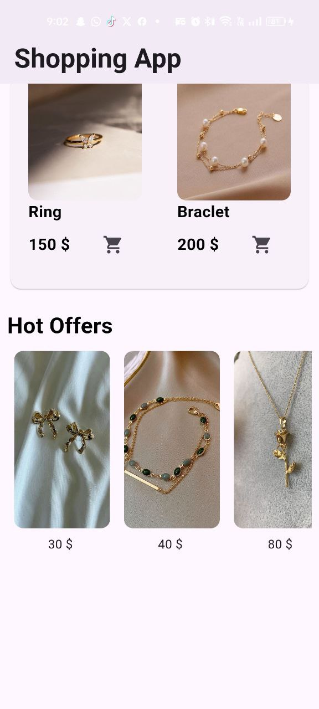

# shopping_app_interface

A new Flutter project for a shopping app interface contains only one screen contains some common flutter widgets : 
1- Statefull widget
2- Column and Row
3- Gridview
4- Listview
5- clipRRect
6- SizedBox
7- card
8- Align
9- Image.assets
10- Text

the app also uses media query for responsivity

## Features

- Responsivity using media quary.
- Add to cart and snackbar confirmation message

## Images

 
## Installtion

1. Clone the repository.
2. Run `flutter pub get`.
3. Run the app using `flutter run`.

## Contributing

Pull requests are welcome. For major changes, please open an issue first
to discuss what you would like to change.

Please make sure to update tests as appropriate.

## Getting Started

This project is a starting point for a Flutter application.

A few resources to get you started if this is your first Flutter project:

- [Lab: Write your first Flutter app](https://docs.flutter.dev/get-started/codelab)
- [Cookbook: Useful Flutter samples](https://docs.flutter.dev/cookbook)

For help getting started with Flutter development, view the
[online documentation](https://docs.flutter.dev/), which offers tutorials,
samples, guidance on mobile development, and a full API reference.

## License
