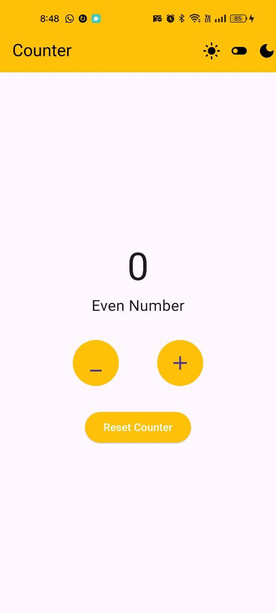
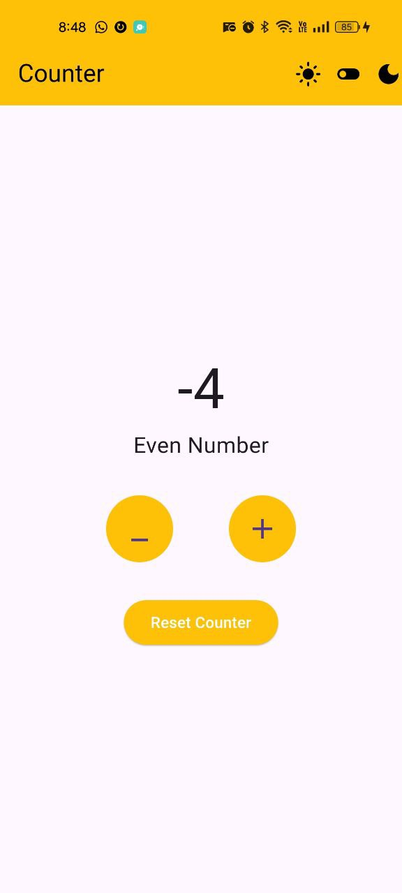
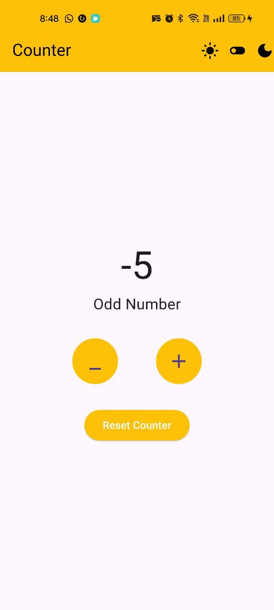
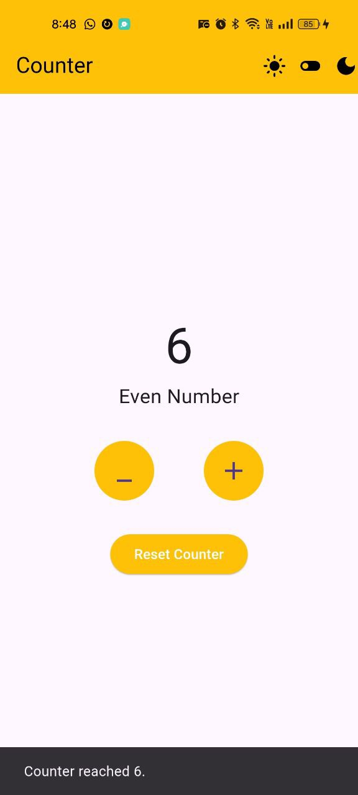
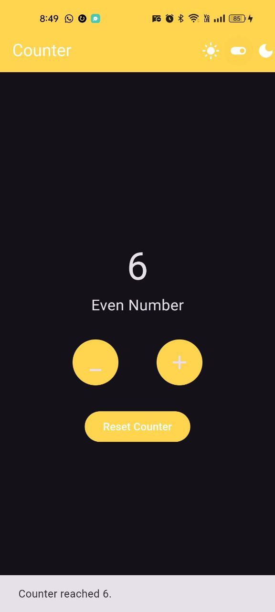
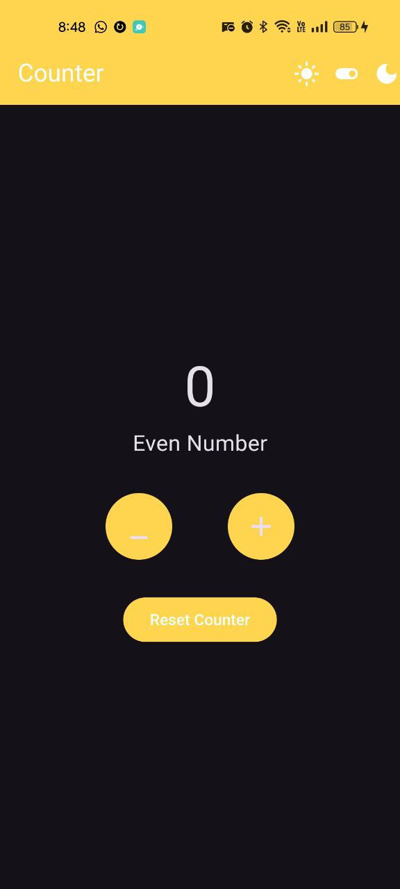

# bloc_counter

A new Flutter project using Bloc state management to implement a basic counter add and subtract 1 from the counter value , with a button to reset the counter . The app also toggle between light and dark theme.

## Features 

 - Add 1 to or subtract 1 from the counter value.
 - Reset the counter.
 - Toggle Between Light and Dark theme.
 - Custom app colors to match theme mode.
 - Usege of Bloc to control app states like counter states and theme state.

## Dependencies
flutter_bloc: ^9.0.0

## Images

Light mode 
    
  

Dark mode 
  

## Installtion

 1. Clone the repository.
 2. Run 'flutter pub get' .
 3. Run the app using 'flutter run' .

## Contributing

Pull requests are welcome. For major changes, please open an issue first
to discuss what you would like to change.

Please make sure to update tests as appropriate.

## Getting Started

This project is a starting point for a Flutter application.

A few resources to get you started if this is your first Flutter project:

- [Lab: Write your first Flutter app](https://docs.flutter.dev/get-started/codelab)
- [Cookbook: Useful Flutter samples](https://docs.flutter.dev/cookbook)

For help getting started with Flutter development, view the
[online documentation](https://docs.flutter.dev/), which offers tutorials,
samples, guidance on mobile development, and a full API reference.

## Auther 
 Roaa Gawish 

## License